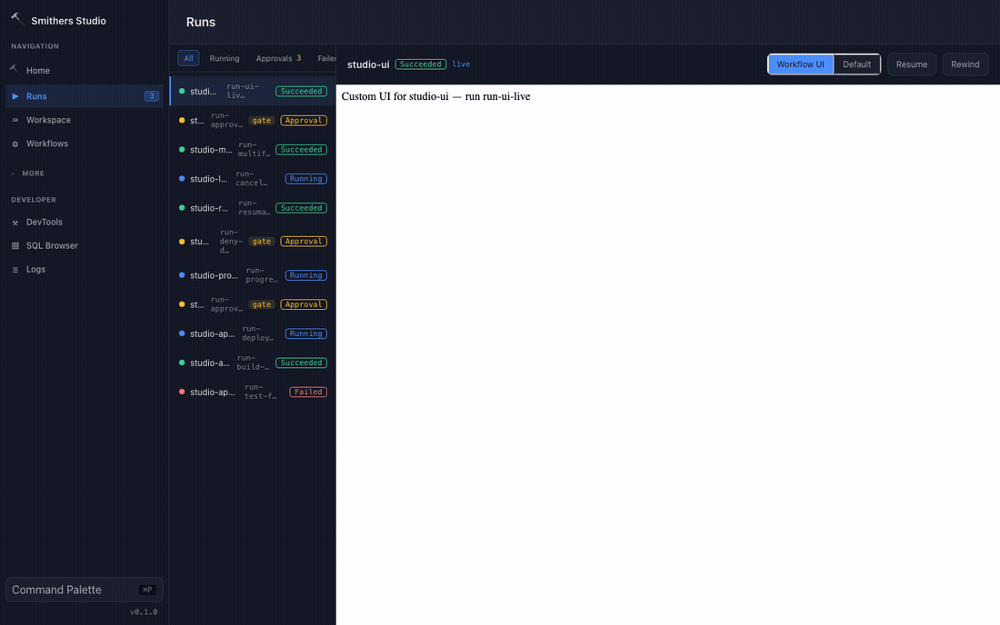
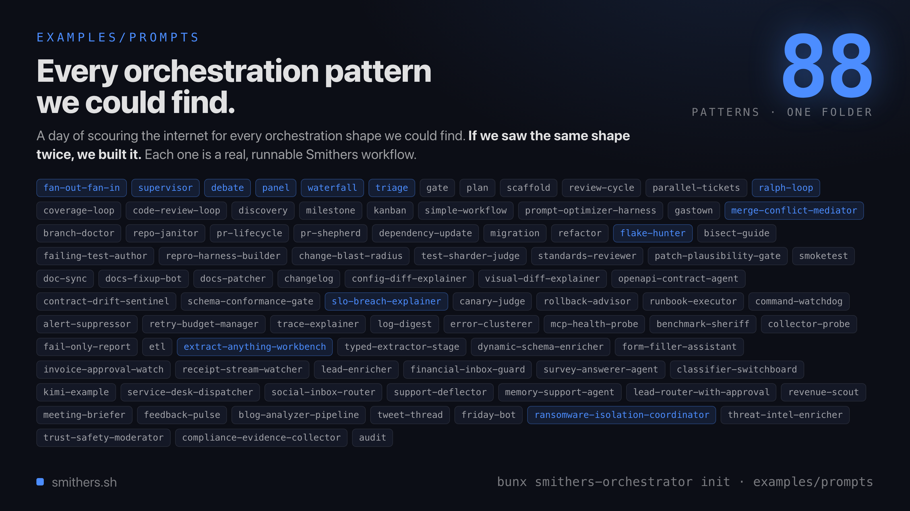

# Smithers

**Run long-horizon coding-agent work as durable workflows.**

[](https://www.npmjs.com/package/smithers-orchestrator)
[](https://github.com/smithersai/smithers/actions/workflows/ci.yml)
[](#license)
[](https://smithers.sh)

Tell your coding agent to do real, multi-step work, then Smithers runs it for minutes or
days with crash recovery, retries, human approvals, and full observability. The same
workflow runs across Claude Code, Codex, Pi, AI SDK models, and remote sandboxes.



*A workflow run is a list of steps you can watch, pause, approve, and rewind. The run above shows several in flight at once.*

## What you get

- 🛡️ **Durable runs that survive crashes**: every completed step is persisted the moment it
  finishes, so a run resumes from where it stopped instead of starting over.
- 🔌 **Any agent, any model**: Claude Code, Codex, Pi, Antigravity, and more, plus any model
  through the AI SDK. Swap the harness without rewriting the workflow.
- 🛠️ **Higher-quality output**: review loops, human approvals, and evals give agents the
  structure that real work demands.
- 🧩 **Dozens of ready-to-run workflows**: planning, implementation, review, debugging,
  tickets, audits, and long-horizon missions. Your agent can author new ones.

## When to use Smithers

| You want to… | Smithers? |
| --- | --- |
| Get one answer from one prompt | No, call the model directly |
| Ship a chatbot or a simple tool-calling app | Usually no |
| Let a coding agent change a repo across many steps | **Yes** |
| Pause for a human approval, then resume later | **Yes** |
| Run several agents that review, retry, and converge | **Yes** |
| Survive crashes and replay, fork, or rewind a run | **Yes** |
| Run durable backend jobs unrelated to agents | Consider [Temporal](https://temporal.io) or [Inngest](https://www.inngest.com) |
| Host stateful per-user session agents | Consider [Cloudflare Agents](https://developers.cloudflare.com/agents/) |

Smithers is the durable runtime for *coding-agent* work: when the unit of work is an agent
editing a real repository over many steps, and you need that work to be inspectable,
approvable, and recoverable.

## Get started

Smithers is driven by your coding agent, **not** a GUI you click. Your agent runs Smithers
on your behalf: it scaffolds workflows, kicks off runs, watches them, and handles
approvals.

One command sets everything up. From inside your project:

```bash
bunx smithers-orchestrator init
```

`init` does everything:

- **Installs the `smithers` skill** into the coding agents on your machine (Claude Code,
  Pi, and more), so your agent knows how and when to use Smithers. No `mkdir`, no `curl`.
- **Scaffolds `.smithers/`** with ready-made workflows (`hello`, `implement`, `plan`,
  `review`, `debug`, and more) your agent can pick from.

Then just ask:

> *"orchestrate an agent to add rate limiting and keep iterating until the tests pass."*

Your agent picks the right workflow, starts the run, and keeps going through retries and
review loops until the work is actually done.

To wire the MCP server into every detected agent too, run `bunx smithers-orchestrator mcp
add`. See [Agent Support](https://smithers.sh/agents/overview) for the full per-agent
matrix, and [`skills/smithers/`](./skills/smithers) for the onboarding skill itself.

## Drive it yourself

Prefer the CLI? The seeded `hello` workflow is the smallest possible run, and its entire
prompt is an editable Markdown file at `.smithers/prompts/hello.mdx`:

```bash
# run your first workflow (edit .smithers/prompts/hello.mdx to change it)
bunx smithers-orchestrator workflow run hello

# turn a request into a practical implementation plan
bunx smithers-orchestrator workflow run plan --prompt "add rate limiting, audit logging, and API key rotation"
```

You can chain a request from tickets to implementation:

```bash
# break a request into ticket files under .smithers/tickets/
bunx smithers-orchestrator workflow run tickets-create --prompt "add rate limiting, audit logging, and API key rotation"

# implement the tickets, each in its own worktree branch
bunx smithers-orchestrator workflow run kanban
```

Run `bunx smithers-orchestrator starters` to browse plain-English starters, and
`bunx smithers-orchestrator workflow list` to see what's installed.

## Watch your runs

Whether your agent started a run or you did, you can see exactly what's happening:

```bash
bunx smithers-orchestrator ps              # list active, paused, and recently completed runs
bunx smithers-orchestrator inspect RUN_ID  # steps, agents, approvals, and outputs for one run
bunx smithers-orchestrator logs RUN_ID     # tail the event log
bunx smithers-orchestrator chat RUN_ID     # read the agent's chat output
```

`ps` shows you what needs attention (a paused approval, a recent failure); `inspect` drills
into a single run so you can follow each step and agent as it works.

## Durable by default

Durability is the differentiator. Runs survive crashes, restarts, and flaky tools because
**every completed step is persisted to SQLite the moment it finishes**. The runtime always
knows what's done and what to run next. Approvals, human questions, retries, and replay are
first-class.

```text
prompt → render workflow → run task → validate output → persist to SQLite → re-render → resume · inspect · replay
```

That loop is the whole model: a task runs, its output is validated against a schema and
written down, then the workflow re-renders from persisted state to decide the next task. A
crash at any point resumes from the last write, not from the top.

```bash
bunx smithers-orchestrator up workflow.tsx --input '{"description":"Fix bug"}'
bunx smithers-orchestrator up workflow.tsx --run-id abc123 --resume true   # resume after a crash
bunx smithers-orchestrator rewind abc123 --frame 4                          # time-travel to an earlier frame
bunx smithers-orchestrator fork abc123                                      # branch an alternate timeline
bunx smithers-orchestrator replay abc123                                    # replay from a checkpoint
```

## Any agent, any model

Smithers doesn't bet on one lab or one harness. Point a task at whichever agent is best for
the job, mix several in one workflow, and switch freely. The workflow doesn't change when
the model does, so a frontier model can plan, a fast model can fan out, and a specialized
harness can do the edits.

**Agents that run tasks**

| Agent | How it runs |
| --- | --- |
| [Claude Code](./docs/integrations/cli-agents.mdx) | CLI harness |
| Codex | CLI harness |
| [Pi](./docs/integrations/pi-integration.mdx) | CLI harness |
| Antigravity | CLI harness |
| Any [AI SDK](./docs/integrations/sdk-agents.mdx) model | SDK agent, with tools, structured output, and MCP |

**Sandboxes that isolate them**

The same `<Sandbox>` primitive runs an agent locally or on a remote provider with no change
to the workflow:

| Target | Notes |
| --- | --- |
| Local | default, runs on your machine |
| [gVisor](https://gvisor.dev) | syscall-isolated containers |
| Kubernetes | your own cluster |
| [Freestyle](https://freestyle.sh) · [Daytona](https://daytona.io) · [Cloudflare](https://workers.cloudflare.com) | managed remote sandboxes |

Beyond [`init`](#get-started), `bunx smithers-orchestrator mcp add` also wires the MCP
server into Cursor, Copilot, Hermes, OpenClaw, and ~20 more coding agents.

## Built-in workflows

`bunx smithers-orchestrator init` installs a pack of ready-to-run workflows. Point your agent at one and go
via `bunx smithers-orchestrator workflow run WORKFLOW_ID --prompt "..."`:

**Build**

| Workflow | What it does |
| --- | --- |
| `implement` | Implement a focused change with validation and review feedback loops. |
| `research-plan-implement` | Research a request, produce a plan, then implement it with validation and review. |
| `ticket-create` / `tickets-create` | Turn a request into one or many structured implementation tickets. |
| `kanban` | Implement ticket files in worktree branches, board-style. |

**Plan**

| Workflow | What it does |
| --- | --- |
| `plan` | Create a practical implementation plan before code changes begin. |
| `research` | Gather repository and external context before planning or building. |
| `grill-me` | Ask targeted questions until vague requirements become actionable. |
| `mission` | Run long-horizon work as approved milestones with focused workers and validation. |

**Quality**

| Workflow | What it does |
| --- | --- |
| `review` | Review current repository changes with one or more configured agents. |
| `debug` | Reproduce, fix, validate, and review a reported bug. |
| `improve-test-coverage` | Find and add high-impact missing tests for the repository. |
| `audit` | Audit feature groups for tests, docs, observability, and maintainability gaps. |
| `feature-enum` | Build or refine a code-backed feature inventory for a repository. |
| `ralph` | Keep working continuously on an open-ended maintenance prompt. |

See [`docs/workflows/`](./docs/workflows/overview.mdx) for the full pack.

## Examples

The [`examples/`](./examples) folder has 100+ runnable workflows, one per orchestration
pattern. Copy one as a starting point:

[](./examples)

| Example | Pattern |
| --- | --- |
| [`code-review-loop`](./examples/code-review-loop.jsx) | Implement → review → fix, looped until approved. |
| [`coverage-loop`](./examples/coverage-loop.jsx) | Run tests, measure coverage, write tests, repeat to target. |
| [`panel`](./examples/panel.jsx) | N specialist agents review in parallel, a moderator synthesizes. |
| [`supervisor`](./examples/supervisor.jsx) | A boss agent plans and delegates to workers dynamically. |
| [`fan-out-fan-in`](./examples/fan-out-fan-in.jsx) | Split work across N parallel agents, aggregate results. |
| [`parallel-tickets`](./examples/parallel-tickets.jsx) | Triage, run waves of work in parallel, merge-queue the results. |
| [`migration`](./examples/migration.jsx) | Plan → transform files → validate → report. |
| [`pr-shepherd`](./examples/pr-shepherd.jsx) | Watch a PR, gather context, leave structured review comments. |
| [`playwright-test-agent`](./examples/playwright-test-agent.jsx) | Plan E2E flows, generate Playwright tests, run/heal until stable. |
| [`adaptive-rag-citation-loop`](./examples/adaptive-rag-citation-loop.jsx) | Retrieve evidence, draft cited answers, grade grounding, retry. |
| [`sql-analyst-dashboard`](./examples/sql-analyst-dashboard.jsx) | Discover schema, check read-only SQL, execute, summarize with a chart. |
| [`rfp-response-room`](./examples/rfp-response-room.jsx) | Extract RFP requirements, draft cited answers, review, package. |
| [`calendar-negotiator-with-approval`](./examples/calendar-negotiator-with-approval.jsx) | Rank meeting slots and write calendar state only after approval. |
| [`document-exception-queue`](./examples/document-exception-queue.jsx) | Extract document packets, reconcile them, route exceptions. |

That's fourteen of 100+. The folder also covers debates, canary judging,
SLO-breach explainers, repo janitors, and dozens more. Browse the full set in
[`examples/`](./examples).

## Author your own

The built-in workflows are normal Smithers TSX files: run them as-is, have your agent
adapt them to your repo, or have it write new ones from the same primitives. A workflow
is a JSX tree of tasks:

```tsx
import { createSmithers, Sequence } from "smithers-orchestrator";
import { z } from "zod";

const { Workflow, Task, smithers, outputs } = createSmithers({
  analyze: z.object({
    summary: z.string(),
    severity: z.enum(["low", "medium", "high"]),
  }),
  fix: z.object({
    patch: z.string(),
    explanation: z.string(),
  }),
});

export default smithers((ctx) => (
  <Workflow name="bugfix">
    <Sequence>
      <Task id="analyze" output={outputs.analyze} agent={analyzer}>
        {`Analyze the bug: ${ctx.input.description}`}
      </Task>

      <Task id="fix" output={outputs.fix} agent={fixer}>
        {`Fix this issue: ${ctx.latest("analyze").summary}`}
      </Task>
    </Sequence>
  </Workflow>
));
```

Each task output is validated against its Zod schema and persisted to SQLite. If the
process crashes, Smithers resumes from the last completed node without re-running
finished work.

### Components

| Component    | Purpose                        |
| ------------ | ------------------------------ |
| `<Workflow>` | Root container                 |
| `<Task>`     | AI or static task node         |
| `<Sequence>` | Ordered execution              |
| `<Parallel>` | Concurrent execution           |
| `<Branch>`   | Conditional execution          |
| `<Ralph>`    | Loop until a condition is met  |

```tsx
<Ralph until={ctx.latest("validate")?.approved} maxIterations={5}>
  <Task id="implement" output={outputs.implement} agent={coder}>
    Fix based on feedback
  </Task>

  <Task id="validate" output={outputs.review} agent={reviewer}>
    Review the implementation
  </Task>
</Ralph>
```

There are many more: approvals, merge queues, sub-workflows, signals, timers, sagas, and
composite patterns. See [Components](https://smithers.sh/components/workflow).

## Deeper capabilities

- **Observability**: every run emits Prometheus metrics and OpenTelemetry traces. Bring up
  the local stack with `bunx smithers-orchestrator observability --detach` (Grafana, Prometheus, Tempo, OTLP
  collector) and serve metrics with `bunx smithers-orchestrator up workflow.tsx --serve --metrics`.
- **Evals**: run repeatable workflow regressions from JSON/JSONL cases with
  `bunx smithers-orchestrator eval workflow.tsx --cases evals/smoke.jsonl --suite smoke`; the command exits
  non-zero when any case fails.
- **Prompt optimization**: run GEPA-style optimization against an eval suite with
  `bunx smithers-orchestrator optimize`, which writes an optimized prompt artifact only when the score
  improves.
- **Hot reload**: edit prompts, config, agent settings, or JSX structure mid-run with
  `bunx smithers-orchestrator up workflow.tsx --hot`. In-flight tasks finish on their original code; only
  newly scheduled tasks pick up changes.
- **Scale across machines**: run agents in remote sandboxes via the `<Sandbox>` primitive
  ([provider table above](#any-agent-any-model)) with no change to the workflow. Start from
  [`examples/freestyle-sandbox-provider`](./docs/examples/freestyle-sandbox-provider.mdx)
  and the [Sandbox component](https://smithers.sh/components/sandbox).

## Security and safety

Smithers is built for agents that modify real repositories, so control is wired into the
runtime:

- **Approvals**: gate destructive or risky steps behind a human `approve` / `deny` before
  they run.
- **Inspectable**: every step, tool call, and output is persisted and replayable, so you
  can see exactly what an agent did and why.
- **Reversible**: `rewind`, `fork`, or `replay` any run from a checkpoint instead of living
  with whatever the agent left behind.
- **Isolated**: run agents in a [sandbox](#any-agent-any-model) (gVisor, Kubernetes,
  Freestyle, Daytona, Cloudflare) so edits never touch your host.
- **Auditable**: every run emits Prometheus metrics and OpenTelemetry traces.

## Read next

- [Install the agent skill](./skills/smithers): make your coding agent fluent in Smithers.
- [Tour](https://smithers.sh/tour): a guided walk through a real run.
- [How It Works](https://smithers.sh/how-it-works): the durable execution model.
- [Components](https://smithers.sh/components/workflow): the full primitive set.

## Docs

Full documentation lives at **[smithers.sh](https://smithers.sh)**.

## License

MIT
