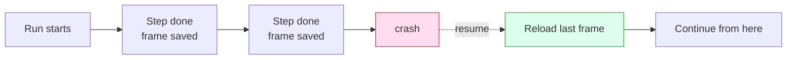

You need six ideas. Each one is a single sentence, a single picture, and a single thing you can say to your coding agent.

Smithers is the durable runtime your agent drives. You don't write the workflow by hand. You describe the work in plain English, your agent renders it as a Smithers workflow, and the runtime does the rest. These six concepts are what make "the rest" worth having.

## 1. Durability: finished work stays finished

Every completed step is saved. If the machine dies mid-run, Smithers resumes from the last completed step — it never re-runs work that already succeeded.

That's the **render → execute → persist** loop in one sentence: each step is executed, its output is persisted as a *frame*, and a crash just means you reload the last frame and keep going. (The deep version lives in [How It Works](/how-it-works).)

<Frame caption="A run survives a crash mid-flight and picks up at the last completed step — no re-doing finished work.">
  
</Frame>

Say to your agent:

> "Kick off the implement run. If my laptop sleeps, just resume it."

Smithers reloads the last saved frame and continues — the steps that already passed don't run twice.

## 2. It loops until true, not once-and-done

Smithers iterates. It runs implement → check → review in a loop until a condition is met, instead of making one attempt and handing you the result.

This is the difference between an agent that takes a swing and an agent that keeps swinging until the tests are green. One-shot output is where slop comes from. A loop with a real exit condition is how you get quality.

Say to your agent:

> "Keep implementing and re-running the tests until they all pass."

Smithers renders a loop: implement, run tests, read the result, and only stop when every test passes (or it hits the iteration ceiling and tells you).

## 3. Approvals: a paused run is just a row in a database

You can put a human in the loop. A run that's waiting for your approval is paused as a row in SQLite — it costs nothing while it waits. No process burning, no timer, no idle compute.

Pause for a day. Pause for a week. The run is durable state, not a held-open connection. When you approve, it resumes from exactly where it stopped.

Say to your agent:

> "Plan the migration, then pause for my approval before touching the database."

Smithers runs the planning steps, hits the approval gate, and stops. You review. One `approve` later, the run continues into the steps you green-lit.

## 4. Time travel: rewind, fork, retry

Every step is a saved frame, so you can go backwards. Rewind to any earlier frame, fork from there, and try a different approach — without losing the original run.

The first attempt isn't gone. It's a branch you can compare against. Didn't like the refactor? Rewind to before it and send the agent down a different path.

<Frame caption="One run forks into two from a saved frame, so a failed approach becomes a branch you can retry instead of a dead end.">
  
</Frame>

Say to your agent:

> "Rewind that run to before the refactor and try a different approach."

Smithers forks a new run from the frame before the refactor and re-renders forward — same starting state, new direction. The original stays intact for comparison. (Details: [How It Works](/how-it-works#time-travel).)

## 5. Any agent, any model

Smithers is not tied to one AI. **Any agent, any model, any machine.** A frontier model can plan while a cheaper one fans the work out — you pick the right brain for each step.

| Step | Good fit | Why |
|---|---|---|
| Plan / architect | A frontier model | Hard reasoning, one call, worth the cost |
| Fan-out implementation | Cheaper, faster models | Many parallel tasks, each small |
| Review / second opinion | A different model entirely | Independent eyes catch what the author missed |

<Frame caption="Plan with one model, implement with another, review with a third — Smithers routes each step to the model that fits it.">
  
</Frame>

Say to your agent:

> "Use a frontier model to plan, then fan the implementation out across cheaper models."

Smithers assigns the planning step to the strong model and spreads the implementation steps across the cheaper ones — in parallel, each in its own task.

## 6. Isolation: parallel work doesn't collide

When Smithers runs work in parallel, each agent gets its own worktree or sandbox. Two agents editing the same repo at once don't trample each other — they each have their own copy, and the results merge back cleanly.

This is what makes fan-out safe. Ten tickets, ten worktrees, ten agents — no shared mutable mess. The `kanban` workflow does exactly this: each ticket gets its own worktree branch.

<Frame caption="The three-layer stack — your agent on top, the Smithers runtime in the middle, isolated execution underneath — is what keeps parallel agents from colliding.">
  
</Frame>

Say to your agent:

> "Work all the open tickets at once, each in its own branch."

Smithers fans the tickets out, gives each its own worktree, and runs the agents in parallel without one stepping on another.

## And the one rule above all six: you drive it through your agent

You never hand-write any of this. You describe the outcome, and **you drive it through your agent** — it renders the loop, the approval gate, the fan-out, the isolation. These six concepts are the vocabulary you use to ask for exactly the run you want. The next page shows how that conversation actually goes.

## Read next

<CardGroup cols={2}>
  <Card title="Talk to your agent" href="/guide/talk-to-your-agent">
    How the conversation actually works — what to say, what comes back.
  </Card>
  <Card title="What you can do" href="/guide/what-you-can-do">
    The built-in workflows and the kinds of work you can hand off.
  </Card>
  <Card title="How It Works" href="/how-it-works">
    The render → execute → persist loop, frames, and resume in detail.
  </Card>
  <Card title="Why React?" href="/why-react">
    Why a JSX runtime, and why time travel comes for free.
  </Card>
</CardGroup>
