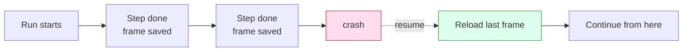

You need six ideas. Each is one sentence, one picture, and one thing you can say to your coding agent. You don't write the workflow; you describe the work in plain English, your agent renders it, and the runtime does the rest. These six are what make "the rest" worth having.

## 1. Durability: finished work stays finished

Every completed step is saved. If the machine dies mid-run, Smithers resumes from the last completed step and never re-runs work that succeeded. That's the **render → execute → persist** loop: run a step, persist its output as a *frame*, and a crash just means reload the last frame and continue. (Deep version: [How It Works](/how-it-works).)

<Frame caption="A run survives a crash mid-flight and picks up at the last completed step, with no re-doing finished work.">
  
</Frame>

> "Kick off the implement run. If my laptop sleeps, just resume it."

## 2. It loops until true, not once-and-done

Smithers iterates. It runs implement → check → review until a condition is met, instead of taking one swing and handing you the result. One-shot output is where slop comes from; a loop with a real exit condition is how you get quality.

> "Keep implementing and re-running the tests until they all pass."

## 3. Approvals: a paused run is just a row in a database

You can put a human in the loop. A run waiting for approval is paused as a row in SQLite, so it costs nothing while it waits: no process burning, no timer, no idle compute. Pause for a day or a week; approve, and it resumes from exactly where it stopped.

> "Plan the migration, then pause for my approval before touching the database."

## 4. Time travel: rewind, fork, retry

Every step is a saved frame, so you can go backwards. Rewind to any earlier frame, fork from there, and try a different approach without losing the original run. The first attempt isn't gone; it's a branch you can compare against. (Details: [How It Works](/how-it-works#time-travel).)

<Frame caption="One run forks into two from a saved frame, so a failed approach becomes a branch you can retry instead of a dead end.">
  
</Frame>

> "Rewind that run to before the refactor and try a different approach."

## 5. Any agent, any model

Smithers is not tied to one AI. **Any agent, any model, any machine.** A frontier model can plan while a cheaper one fans the work out: you pick the right brain for each step.

| Step | Good fit | Why |
|---|---|---|
| Plan / architect | A frontier model | Hard reasoning, one call, worth the cost |
| Fan-out implementation | Cheaper, faster models | Many parallel tasks, each small |
| Review / second opinion | A different model entirely | Independent eyes catch what the author missed |

<Frame caption="Plan with one model, implement with another, review with a third: Smithers routes each step to the model that fits it.">
  
</Frame>

> "Use a frontier model to plan, then fan the implementation out across cheaper models."

## 6. Isolation: parallel work doesn't collide

When Smithers runs work in parallel, each agent gets its own worktree or sandbox, so two agents editing the same repo don't trample each other; the results merge back cleanly. That's what makes fan-out safe: ten tickets, ten worktrees, ten agents, no shared mutable mess. The `kanban` workflow does exactly this.

<Frame caption="The three-layer stack (your agent on top, the Smithers runtime in the middle, isolated execution underneath) is what keeps parallel agents from colliding.">
  
</Frame>

> "Work all the open tickets at once, each in its own branch."

## The one rule above all six: you drive it through your agent

You never hand-write any of this. You describe the outcome and **drive it through your agent**, which renders the loop, the gate, the fan-out, the isolation. These six are the vocabulary for asking for exactly the run you want.

## Read next

<CardGroup cols={2}>
  <Card title="Talk to your agent" href="/guide/talk-to-your-agent">
    How the conversation actually works: what to say, what comes back.
  </Card>
  <Card title="What you can do" href="/guide/what-you-can-do">
    The built-in workflows and the kinds of work you can hand off.
  </Card>
  <Card title="How It Works" href="/how-it-works">
    The render → execute → persist loop, frames, and resume in detail.
  </Card>
  <Card title="Why React?" href="/why-react">
    Why a JSX runtime, and why time travel comes for free.
  </Card>
</CardGroup>
