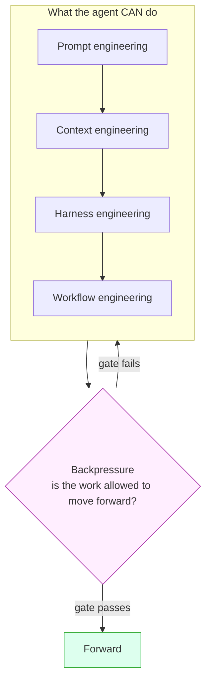

Writing a better prompt is the smallest lever. Getting an agent to reliably finish
real work is a **layered control system**, and most of those layers live *around*
the model, not inside the prompt. Smithers owns the outer layers so you can
describe an outcome and let the system assemble the rest.

## The layers

| Layer | What it controls | Where it lives in Smithers |
| --- | --- | --- |
| **Prompt engineering** | instructions, examples, role, output format, success criteria | the prompt `.mdx` a `<Task>` renders |
| **Context engineering** | what information, tools, memory, schemas, and state enter the model each step | the workflow graph + [memory](/how-it-works) + typed outputs |
| **Harness engineering** | runtime, tools, conventions, permissions, retries, fresh-context loops | `agents.ts`, [sandboxes](/components/sandbox), tools, `repoCommands` |
| **Workflow engineering** | order, parallelism, review loops, approvals, resumability, artifacts | the Smithers runtime itself |
| **Backpressure** | every desired behavior becomes a gate, test, eval, schema, reviewer, approval, or loop condition | Zod outputs, `bunx smithers-orchestrator eval`, `<ReviewLoop>`, `<Approval>`, traces |

The first four shape what the agent *can* do; **backpressure** decides whether the
work is allowed to move forward. A workflow that just "tries its best and moves on"
has no backpressure, and that is where unreliable agents come from.



## Backpressure, concretely

Turn each success criterion into a verification signal, and pick the Smithers
primitive that enforces it:

- **Schema**: the step must return a shape: a Zod `output={...}` on the `<Task>`.
- **Test**: generated code must pass: a function task shelling out to `repoCommands.test`.
- **Eval**: an answer must satisfy examples/rubrics: `bunx smithers-orchestrator eval` + [scorers](/guides/evals-quickstart).
- **Review**: another agent (or human) must approve: [`<ReviewLoop>`](/components/loop) / `<Panel>`.
- **Approval**: a human signs off before a risky action: [`<Approval>`](/components/approval).
- **Dependency**: step B can't start until step A produced a field: gate on `ctx.outputMaybe(...)`.
- **Trace**: tool calls, retries, and handoffs must be visible: [observability](/guides/evals-quickstart) + `bunx smithers-orchestrator events`.

Loop until the gate passes (`<Loop>` / `<Ralph until={…}>`) rather than running once
and hoping.

Command gates should classify the failure evidence before they mark work red. A
typecheck is a code failure when `tsc --noEmit` reports TypeScript diagnostics such
as `error TS...`; a nonzero exit, signal, OOM, or timeout with no diagnostics is an
infrastructure failure and should be retried with more headroom before surfacing as
retryable. Test gates follow the same rule: failed tests are red, but a crashed or
timed-out runner with no failed-test report is transient infrastructure, not proof
the patch is bad.

## Sequence for reversibility; isolate the irreversible

Order the work so the reversible, low-stakes steps run first and the irreversible
side effect runs last, behind a gate. Everything before that point is safe to retry,
replay, or throw away. The wire transfer, the production deploy, the email to every
customer: those are the steps you cannot take back, so those are the steps you push
to the end and guard.

The sharper rule is to split the decision from the act. An agent that both decides to
send money and sends it has fused a reversible step, deciding, with an irreversible
one, sending, and you can no longer review or rerun the first without risking the
second. So do not let the agent send the money. Have it return a typed decision, and
make the payout its own downstream task behind an approval gate:

```tsx
// Reversible: cheap to review, safe to retry, replays deterministically.
<Task id="decide-payout" output={outputs.payout} agent={analyst}>
  Should we release the vendor payout? Return shouldPay, amount, and a reason.
</Task>;

// Irreversible: its own task, the only step that touches money, gated by a human.
const payout = ctx.outputMaybe(outputs.payout, { nodeId: "decide-payout" });
payout?.shouldPay && (
  <Sequence>
    <Approval
      id="payout-gate"
      output={outputs.payoutGate}
      request={{ title: `Release $${payout.amount}?`, summary: payout.reason }}
    />
    <Task id="send-payout" output={outputs.receipt} agent={treasury}>
      Wire ${payout.amount} to the vendor, keyed for idempotency.
    </Task>
  </Sequence>
);
```

This buys four things the fused version cannot. The decision is a typed row you can
read, score, and replay. The act is its own node in the graph, so it shows up in
traces and is something a human can approve in isolation. The approval gate puts a
person on the exact amount before any money moves. And the side effect stays
idempotent on retry, because the tool it calls is marked `sideEffect: true` and keyed
with `ctx.idempotencyKey` (see [Mark side-effecting tools and key
them](/guides/common-footguns#mark-side-effecting-tools-and-key-them)). It is the
same move a database makes: do all the work that can roll back, then commit once, at
the end.

## A model call is stateless; context is the only control surface

For a fixed model, output quality is a function of one input: the context window
you hand it. The model keeps nothing between calls. Each call starts from zero and
reads only what you put in front of it. So "get a better result" means "manufacture
a better context window", and an agent is a loop that does exactly that, over and
over.

Every tool an agent runs is one of three context moves:

1. **Delete incorrect context.** This is the worst kind to leave in. A wrong fact
   or a dead path is a false anchor: the model keeps rationalizing toward it and
   tunnels. If you must keep a failed attempt, distill it to one line ("tried X,
   failed because Y, do not repeat") and drop the rest.
2. **Add missing context.** This is what tools are for. A test run, a diff, a stack
   trace, a file read: each turns an unknown into real tokens the model can reason
   over. An agent without tools guesses. An agent with tools looks.
3. **Remove useless context.** Residue is a tax. The output of a finished task is
   adversarial noise for the next one. The rule of thumb: if you could `/clear`,
   you should `/clear`.

Compression scales all three at once. A good summary deletes the wrong, keeps the
missing, and discards the useless in a single pass.

## Three levers, and they trade off

There are three things you can optimize, and pushing one usually costs another.
Naming them keeps you honest about which one you are spending on.

- **Quality.** More attempts, more model diversity, more verification. Three
  planners beat one. A review loop beats a single pass.
- **Cost.** Cheaper models wherever an eval proves they are good enough. The work
  is proving it, then promoting the cheap model on the strength of the score.
- **Speed.** Parallelism, and refusing to block fast work behind a slow sibling.

Smithers gives you a primitive per lever. `<Panel>` and `<ReviewLoop>` buy quality.
`<Sidecar>` buys cost: it runs a cheap shadow model next to the primary task,
scores both with the same scorer, and reports the delta without ever touching the
result, so over time you see when the cheap model is ready to promote. `<Parallel>`
buys speed.

The quality lever has a worked example in this repo:
[`examples/swe-evo/workflow/swe-evo-panel.tsx`](https://github.com/smithersai/smithers/blob/main/examples/swe-evo/workflow/swe-evo-panel.tsx).
It plans with a model-diverse `<Panel strategy="synthesize">` (three planners draft
independent plans, a moderator synthesizes one), then implements inside a
`<ReviewLoop>` that loops until the reviewers approve. The reviewer approval is a
proxy for the hidden test suite, so the loop climbs toward a signal it cannot see
directly.

## Hill climbing, two hills

An agent improves by climbing. There are two hills, and the second one pays more.

The obvious hill is the **output**: generate, critique, regenerate. Write the code,
run the reviewer, fix what the reviewer flagged. `<ReviewLoop>` and `<Optimizer>`
make this loop durable: each pass is a persisted frame, so a crash resumes mid-climb
instead of restarting.

The higher-leverage hill is the **context**. Before the next attempt, ask "what
information would make this attempt obviously better?" and go get it. A failing
test, the actual file instead of a guess about it, a synthesized plan instead of a
cold start. The swe-evo panel climbs both at once: the panel manufactures a better
context (a synthesized plan) before the first line of code, and the review loop
climbs the output after.

## The smart zone

Agents perform best under about 200k tokens of context, and noticeably better under
100k. Past that, attention thins and quality drops. So the move is to give an agent
a goal it can finish inside that budget, with the research and planning already
done, so it spends its window on the work instead of on discovery. This is why a
research step and a plan step precede implementation: they keep the implementer in
the smart zone.

Smithers measures the zone so you are not guessing:

- `smithers.tokens.context_window_per_call` is a histogram of per-call context
  size, bucketed at exactly `[50k, 100k, 200k, 500k, 1M]`.
- `smithers.tokens.context_window_bucket_total` is a counter of how many calls
  landed in each bucket, so you can see drift toward the large buckets.
- Per-node usage shows in `bunx smithers-orchestrator node`, and live as the
  `TokenUsageReported` event (the 🧮 line in the event stream).

The in-workflow guardrail is [`<Aspects tokenBudget>`](/components/aspects). It is
enforced at task dispatch: before each descendant task runs, the engine compares the
run's accumulated token total against `max` and applies `onExceeded` (`fail` raises
`ASPECT_BUDGET_EXCEEDED`, `warn` logs and continues, `skip-remaining` skips the
task). A budget breach is a real, catchable error, which is what makes the durable
`/clear` below possible.

## Plan the validation, not the feature

Your scarce resource is deciding how you will *know* it worked. Spend it where it is
cheapest.

Different pipeline stages cost wildly different amounts to review. Vibe-checking a
finished output is near free, and it lets debt pile up unseen. Reading a 500-line
diff is miserable and you will skim it. Reading a *plan* is cheap and high leverage:
a page of intent, before any code exists. So put your eyeballs where they are
cheapest. Review the plan, then test the output, and skip the diff.

This only works with two things in place:

- **Plans with teeth.** The plan names the tests, the acceptance criteria, and the
  machine-checkable definition of done. A plan that says "implement the feature" has
  no teeth and gates nothing.
- **Real backpressure.** Tests, CI, and types push back on the agent directly. The
  agent feels resistance from the toolchain, not from you squinting at a diff at
  11pm.

The payoff is large. A complex feature attempted cold one-shots maybe 40% of the
time. The same feature, preceded by a vetted plan with teeth and backed by real
gates, one-shots around 98%.

## Goal-based over ambiguous tasks

Write tasks around validation criteria, and leave the implementation details out,
unless a planning step already worked them out (then pass them down to save the
implementer's context). Measurable goals are best: "the suite passes", "the score
clears 0.9", "the schema validates". When a goal is genuinely fuzzy, the goal can be
"a reviewer approves", and you should prefer an agent reviewer over a human one so
the loop stays autonomous.

The validation prompt deserves as much thought as the work prompt. A sloppy reviewer
prompt is a broken feedback channel, and the agent will happily climb toward the
wrong summit.

## Observability is non-negotiable

An agent must always be able to self-validate and debug. It needs a test signal, a
trace, a real error to read. When that channel is missing or broken, treat it as a
fatal condition: stop and fix the channel. Do not keep optimizing against a phantom
signal, because the agent will produce confident work that satisfies a metric you
cannot trust. When you build a feature, invest in the observability that the next
agent will need to debug it.

## The testing bar is higher for agentic code

Never consider a feature working without an end-to-end test that proves it. E2e
tests are the bread and butter here, because an agent that cannot run the whole path
cannot tell whether it is done. Unit tests still earn their place (TDD works well on
small, self-contained snippets), but the e2e test is the one that closes the loop.

A direct consequence is to build in **vertical slices**: one feature working end to
end, then the next. A horizontal slice (a whole service layer for every feature at
once) has nothing to validate until the very end, which is exactly when you want
validation to have been happening all along.

## Attention is finite; delegate the periphery

Keep linters, style guides, commit-message crafting, and the rest of the periphery
out of the primary agent's attention. Push them to cheaper models in separate passes
with fresh, clean context. For version control, lean on the automatic jj snapshotting
Smithers already does instead of spending agent attention on git mechanics.

This generalizes into **sandwich delegation**: smart, expensive agents plan and
review at the two ends, while cheaper agents implement in the middle. Recurse as the
work grows. A capable model can write a Smithers script whose `<Panel>` uses two
strong models to plan and whose `<ReviewLoop>` validates, while cheaper models do the
implementation in between. The more cost-insensitive you are, the more of the middle
you can hand to a strong implementer. Do not spend your most expensive model on work
a cheaper one can do unless you have a reason to.

## POC in the planning phase

A throwaway proof of concept is a fast way to surface the ideas a plan needs. A POC
optimizes for speed and cost, never for quality: you are going to discard it. What
survives is the lessons, and those feed the plan. Treating the POC as production
code is the trap. Build it, learn from it, delete it, then plan.

## Don't over-granularize

Splitting a goal into a dozen babysat micro-tasks is micromanagement, and it costs
you the agent's own judgment about how to get there. Give an agent a goal it can
achieve inside the smart zone and let it figure out the how. When the goal is too big
for one window, orchestrate several agents toward it rather than scripting every
step of one. Task size scales with agent power: a weaker model takes a smaller bite,
a strong model takes a larger one.

## Durable "/clear": a context handoff

A long-running loop accumulates context the way a chat session does. Once it drifts
out of the smart zone, every later turn gets worse. The fix a human does by hand is
`/clear`: drop the residue, keep the few facts that still matter, start fresh.

You can make that automatic and durable by composing three primitives:

- `<Aspects tokenBudget>` sets a hard ceiling on the loop's context. A breach throws
  `ASPECT_BUDGET_EXCEEDED`.
- `<TryCatchFinally catchErrors={["ASPECT_BUDGET_EXCEEDED"]}>` catches exactly that
  code instead of failing the run.
- The catch branch renders `<ContinueAsNew state={...} />`, which closes the current
  run and opens a fresh one carrying only the distilled state, back inside the smart
  zone with no residue.

The code below is the real
[`examples/context-handoff/workflow.tsx`](https://github.com/smithersai/smithers/blob/main/examples/context-handoff/workflow.tsx),
so `bunx smithers-orchestrator graph examples/context-handoff/workflow.tsx --input '{}'`
renders its graph (including the catch branch) and `check-docs` verifies every import
here against the real package facade. That runnable file is the anti-rot teeth: if the
API drifts, the graph render and the typecheck fail.

```tsx
/** @jsxImportSource smithers-orchestrator */
/**
 * Durable "/clear": a context handoff.
 *
 * Agents perform best in the smart zone (under ~200k tokens of context, ideally
 * under ~100k). A long-running loop accumulates context the way a chat session
 * does, and once it drifts out of the smart zone every later turn gets worse.
 * The fix a human does by hand is `/clear`: drop the accumulated residue, keep
 * the few facts that still matter, start fresh.
 *
 * This workflow does that automatically and durably. The pieces:
 *
 *   <Aspects tokenBudget>        a hard token ceiling for the subtree. The
 *                                engine enforces it at task dispatch; a breach
 *                                throws ASPECT_BUDGET_EXCEEDED.
 *   <TryCatchFinally>            an error boundary that catches exactly that
 *                                code and renders the catch branch instead of
 *                                failing the run.
 *   <ContinueAsNew state={...}>  the catch branch. It closes this run and opens
 *                                a fresh one carrying ONLY the distilled state,
 *                                so the new run starts back inside the smart
 *                                zone with no residue.
 *   <Loop>                       the little while loop that does the work. Each
 *                                pass makes one increment of progress until the
 *                                goal is met.
 *
 * Run the graph without executing it:
 *
 *   bunx smithers-orchestrator graph examples/context-handoff/workflow.tsx --input '{}'
 *
 * The DAG includes the catch branch, so the render proves the whole handoff
 * wiring compiles.
 */

import { createSmithers, ClaudeCodeAgent } from "smithers-orchestrator";
// In-repo, "smithers-orchestrator" resolves to a limited examples entry that
// does not re-export <Aspects>/<TryCatchFinally>; import them from the
// components package directly. End-user code can import both from
// "smithers-orchestrator".
import { Aspects, TryCatchFinally } from "@smithers-orchestrator/components";
import { dirname, join } from "node:path";
import { fileURLToPath } from "node:url";
import { z } from "zod/v4";

const here = dirname(fileURLToPath(import.meta.url));

/** The minimal context we carry across a handoff. This, and only this, is what
 *  survives a `/clear`: the goal, which generation we are on, the last summary,
 *  and a short list of durable learnings (distilled wrong paths, not raw logs). */
type DistilledState = {
  goal: string;
  generation: number;
  lastSummary: string;
  learnings: string[];
};

export const schemas = {
  // One increment of work. `learnings` are distilled facts worth carrying
  // forward ("tried X, failed because Y"); `done` ends the loop.
  step: z.object({
    summary: z.string().default(""),
    learnings: z.array(z.string()).default([]),
    done: z.boolean().default(false),
  }),
};

// A local, gitignored DB next to this file so `smithers graph` never touches
// the project's smithers.db.
const api = createSmithers(schemas, { dbPath: join(here, "smithers.db") });
const { smithers, Workflow, Task, Loop, ContinueAsNew, outputs } = api;

// Autonomous agent: bypass flags on, no pinned cwd (that would override a
// <Worktree>). Graph rendering does not run the agent; these are the real
// flags a live run needs.
const worker = new ClaudeCodeAgent({
  model: "claude-opus-4-8",
  permissionMode: "bypassPermissions",
  dangerouslySkipPermissions: true,
});

const MAX_CONTEXT_TOKENS = 150_000;

export default smithers((ctx) => {
  // ctx.input fields arrive raw-or-null, so coalesce every read. The carried
  // state arrives under the continuation envelope on a handoff; on a cold start
  // it is absent and we read the top-level goal instead.
  const input = (ctx.input ?? {}) as {
    goal?: string | null;
    __smithersContinuation?: { payload?: Partial<DistilledState> | null } | null;
  };
  const carried = input.__smithersContinuation?.payload ?? null;
  const goal = carried?.goal ?? input.goal ?? "Make the failing test suite pass.";
  const generation = (carried?.generation ?? 0) + 1;

  // Read this generation's progress out of typed outputs (empty on a fresh
  // render). The loop is done when the last step says so.
  const steps = ctx.outputs.step ?? [];
  const lastStep = steps[steps.length - 1];
  const done = lastStep?.done === true;

  // Distill the state we would hand off: the goal, the next generation number,
  // the latest summary, and the last 10 learnings. Capped on purpose, so the
  // fresh run starts small and back inside the smart zone.
  const distilled: DistilledState = {
    goal,
    generation,
    lastSummary: lastStep?.summary ?? carried?.lastSummary ?? "",
    learnings: [...(carried?.learnings ?? []), ...(lastStep?.learnings ?? [])].slice(-10),
  };

  const prompt = [
    `Goal: ${goal}`,
    carried
      ? `Fresh context, generation ${generation}. Prior summary: ${distilled.lastSummary || "(none)"}.`
      : "Fresh start.",
    distilled.learnings.length
      ? `Known so far:\n${distilled.learnings.map((l) => `- ${l}`).join("\n")}`
      : "",
    "Make one increment of progress. Report a short summary, any durable learnings (distill wrong paths to 'tried X, failed because Y'), and set done=true only when the goal is fully met.",
  ]
    .filter(Boolean)
    .join("\n\n");

  return (
    <Workflow name="context-handoff">
      <Aspects tokenBudget={{ max: MAX_CONTEXT_TOKENS, onExceeded: "fail" }}>
        <TryCatchFinally
          catchErrors={["ASPECT_BUDGET_EXCEEDED"]}
          catch={<ContinueAsNew state={distilled} />}
          try={
            <Loop id="work" until={done} maxIterations={50}>
              <Task id="step" output={outputs.step} agent={worker}>
                {prompt}
              </Task>
            </Loop>
          }
        />
      </Aspects>
    </Workflow>
  );
});
```

## Smithers does the context engineering for you

You should not need to know any of the above to get a workflow. The
[`create-workflow`](/workflows/create-workflow) workflow is the entry point to the
"context engineering for you" layer:

```bash
bunx smithers-orchestrator workflow run create-workflow \
  --prompt "Watch a landing request and auto-land it once CI is green"
```

It clarifies your ask into a spec, **provisions the docs and skills the work needs**
(pulls the relevant `llms-*.txt`, finds the closest `examples/` template, and
installs worker skills via `bunx smithers-orchestrator skills add`), designs the graph, pauses for
your approval, scaffolds the files, verifies the graph renders, and documents the
result. You answer product questions; it produces the prompts, context, components,
and gates.

This is the direction Smithers is heading: a concierge that takes a vague script,
interrogates it, routes it to the right skills and workflows, adds backpressure, runs
as much as it can, and reports legibly. The durable, observable, gated workflow
is something you *describe* rather than hand-build.

## Further reading

The field this builds on: Anthropic and OpenAI on prompting and on evaluating the
model *and* the harness together; LangChain and LlamaIndex on context engineering;
HumanLayer on harness engineering for coding agents; the Ralph loop on
acceptance-driven, fresh-context iteration; and BAML on treating structured output
as schema engineering.
